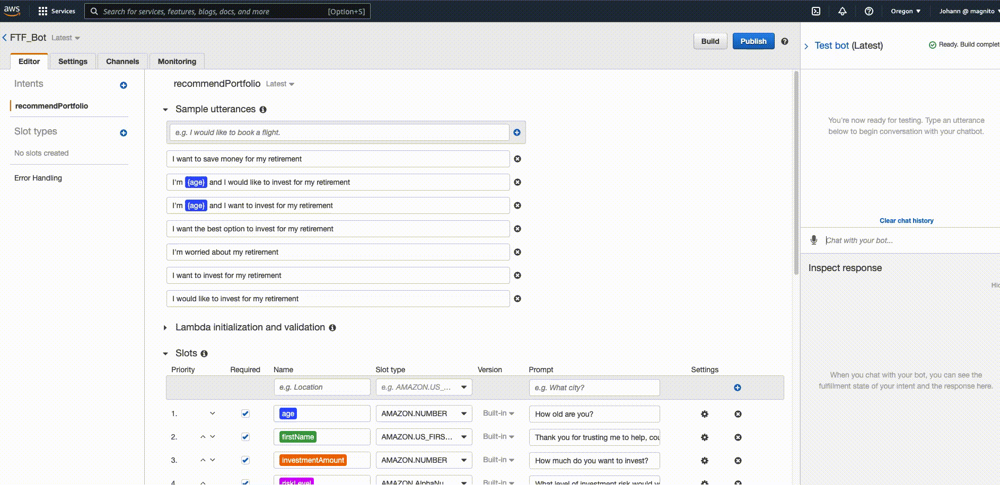

## An Investment Chatbot powered by Amazon Lex & AWS Lambda

---

This Chatbot combines AWS services and Python code to create a bot that will recommend an investment portfolio for a retirement plan.

You can find the lambda code [here](Lambda/lambda_function.py) as well as the [test events](Lambda/Test_Events) code you can use to test your function. 

Here is a demo of the Bot: 

For more advanded capabilities, please check this [Github repo](https://github.com/jojomani/FTF_investment_bot) for a project related to these technologies.